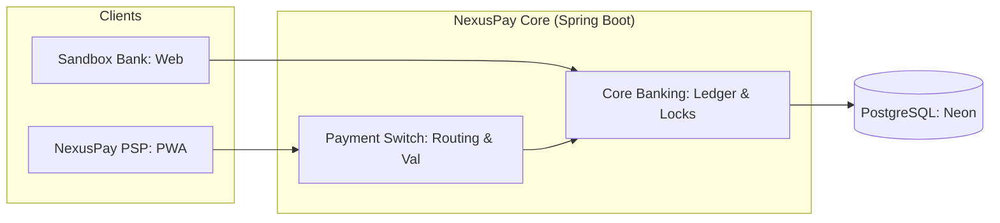

# NexusPay

> **A UPI-inspired Payment Service Provider (PSP) and Sandbox Banking System.**  
> Built to demonstrate high-concurrency backend engineering, ACID-compliant ledger writes, and zero-trust security for fintech-grade applications.

---

## 🚀 Live Demo

*   **[NexusPay PSP](https://nexuspay-psp.vercel.app)**: The mobile-first PWA for VPA transfers and payment history.
*   **[Sandbox Bank](https://nexuspay-bank.vercel.app)**: The core banking portal for account management, PIN security, and ledger inspection.

---

## 🧠 Engineering Thesis

NexusPay isn't just a clone; it's a deep-dive into the primitives that make payment systems correct:

*   **Pessimistic Row-Level Locking:** All transfers use `SELECT ... FOR UPDATE` to serialize concurrent debits at the database level, preventing double-spends even under extreme load.
*   **At-Most-Once Semantics:** Client-generated idempotency keys (`txnReference`) backed by a strict `UNIQUE` constraint ensure that a single payment intent results in exactly one debit, regardless of retries.
*   **Zero-Trust Transaction Flow:** Sender identity is extracted exclusively from validated JWTs. The transfer payload contains no sender account identifiers, eliminating the IDOR attack class by design.
*   **Refresh Token Rotation:** Implements security-first auth with reuse detection; using a rotated refresh token immediately revokes the entire session family.
*   **Deterministic State Machine:** A 5-state frontend machine that recovers cleanly from network drops via automated status polling.

---

## 🛠️ Tech Stack

### Backend (`services/core`)
- **Core:** Java 21 + Spring Boot 3.3.x
- **Persistence:** Spring Data JPA + Hibernate 6
- **Database:** PostgreSQL (Neon Serverless)
- **Migrations:** Flyway (Append-only SQL)
- **Security:** Spring Security + JWT (jjwt) + Google OAuth

### Frontend (`apps/psp` & `apps/bank`)
- **Framework:** Next.js 15 (App Router)
- **Styling:** Tailwind CSS + shadcn/ui
- **State:** TanStack Query (Server State)
- **PWA:** Serwist (Service Workers & Offline Support)

---

## 📦 System Architecture



---

## ⚙️ Local Development

### Prerequisites
- JDK 21
- Node 20+
- pnpm 9+
- Maven 3.9+

### Setup
1.  **Clone & Install:**
    ```bash
    git clone https://github.com/adivishnu-a/nexuspay.git
    cd nexuspay
    pnpm install
    ```
2.  **Environment:**
    *   **Backend:** Copy `services/core/.env.example` to `services/core/.env` and fill in your DB URL, JWT secret, and Google Client ID.
    *   **Apps:** Copy `.env.example` to `.env.local` in both `apps/psp` and `apps/bank`. Ensure `NEXT_PUBLIC_API_URL` points to `http://localhost:8080`.

3.  **Run:**
    ```bash
    # Backend (Terminal 1)
    cd services/core && ./mvnw spring-boot:run

    # PSP (Terminal 2)
    pnpm --filter psp dev

    # Bank (Terminal 3)
    pnpm --filter bank dev
    ```

